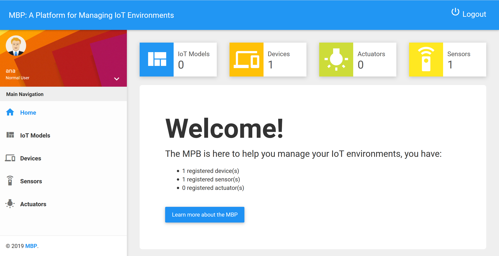

# Multi-purpose Binding and Provisioning Platform (MBP)
This platform enables means for (i) automated binding of IoT devices in order to access their sensors and actuators, and (ii) automated software provisioning.

  
*MBP UI (based on [Bootstrap templates](https://startbootstrap.com/template-overviews/sb-admin-2/))*

How to install the MBP and use its API is explained in detail in the following:  

**[1 Installation](#1-installation)**  
**[2 Quick Start](#2-quick-start)**  
**[3 MBP REST API](#3-mbp-rest-api)**  

## 1 Installation

The following software components are used in order to set up the MBP:  
- [Mosquitto MQTT Broker](https://mosquitto.org/download/)
- [mongoDB server](https://www.mongodb.com/download-center?jmp=nav#community)
- [InfluxDB](https://portal.influxdata.com/downloads/)
- Java8
- [Tomcat8](https://tomcat.apache.org/download-80.cgi)
- Maven

### Installation on Linux 
Please run the [installation script](install.sh), which automatically installs the software components listed above. Once the installation is completed, the MBP will be available on the URL *http://[MBP-Host]:8080/MBP*.  

### Installation on Windows
Please execute the following steps:  
- Install and start [Mosquitto MQTT Broker](https://mosquitto.org/download/), [mongoDB server](https://www.mongodb.com/download-center?jmp=nav#community), [InfluxDB](https://portal.influxdata.com/downloads/) and [Tomcat8](https://tomcat.apache.org/download-80.cgi)   
- Create the *MBP.war* file by building the provided maven project
    
    `$ mvn clean install`  
    
- Deploy the MBP application on Tomcat by moving the `MBP.war` to the Tomcat `webapps` folder  

Once the installation is completed, the MBP will be available on the URL *http://[MBP-Host]:8080/MBP*.
    
### Tip: Cross-Origin Resource Sharing (CORS)

Make sure that [Cross-Origin Resource Sharing (CORS)](https://developer.mozilla.org/en-US/docs/Web/HTTP/CORS) is allowed for all origins. To do that, add the following filter to Tomcat's 'web.xml':

```xml
<filter>
  <filter-name>CorsFilter</filter-name>
  <filter-class>org.apache.catalina.filters.CorsFilter</filter-class>
</filter>
<filter-mapping>
  <filter-name>CorsFilter</filter-name>
  <url-pattern>/*</url-pattern>
</filter-mapping>
```

### Tip: Improving startup time
After a reboot of the hosting system, in order to decrease the restart time that Tomcat takes to make the MBP application available again, it is helpful to adjust the 'java.security' file of the JRE as suggested [in this post](https://stackoverflow.com/a/26432537). Otherwise it may take up to 30 minutes until the MBP can be accessed again. If you are using Linux, the installation script 'install.sh' takes care of this automatically.

## 2 Quick Start

The MBP UI provides two views, the *expert* and *normal* views. The *expert view* shows the full functionality of the MBP, where *IoT (Environment) Models* can be created and managed. Furthermore, *Operators*, *Devices*, *Sensors* and *Actuators* can be manually registered. The *normal view* is a compacter view, in which the operators are hidden.

To start using the MBP, please click [here](https://github.com/IPVS-AS/MBP/wiki/Quick-Start) to see our Quick Start.

## 3 MBP REST API

A REST API for the registration and management of components in an IoT environment is provided. Furthermore, the deployment of software components onto IoT devices, e.g., operators that extract and send sensor values to the MBP, can be as well realized through the MBP API. 

Click [here](https://github.com/IPVS-AS/MBP/wiki/API-Reference) to see the API Reference.

## Haftungsausschluss

Dies ist ein Forschungsprototyp.
Die Haftung für entgangenen Gewinn, Produktionsausfall, Betriebsunterbrechung, entgangene Nutzungen, Verlust von Daten und Informationen, Finanzierungsaufwendungen sowie sonstige Vermögens- und Folgeschäden ist, außer in Fällen von grober Fahrlässigkeit, Vorsatz und Personenschäden, ausgeschlossen.

## Disclaimer of Warranty

Unless required by applicable law or agreed to in writing, Licensor provides the Work (and each Contributor provides its Contributions) on an "AS IS" BASIS, WITHOUT WARRANTIES OR CONDITIONS OF ANY KIND, either express or implied, including, without limitation, any warranties or conditions of TITLE, NON-INFRINGEMENT, MERCHANTABILITY, or FITNESS FOR A PARTICULAR PURPOSE.
You are solely responsible for determining the appropriateness of using or redistributing the Work and assume any risks associated with Your exercise of permissions under this License.
