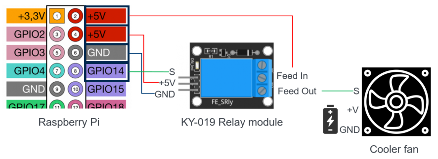

# Control Operator: Scripts to control a relay module

This folder contains operator scripts for a relay module, which can control AC circuits and act as a switch.

## Hardware Setup 

 - a Raspberry Pi
 - a [KY-019 5V Relay module](https://arduinomodules.info/ky-019-5v-relay-module/) plugged to the `digital pin GPIO14` of the Raspberry Pi
 - a [AVC cooler fan](https://www.amazon.de/AVC-F8025R12LA-Prozessor-L%C3%BCfter-Zertifiziert-General%C3%BCberholt/dp/B0756D92SM) or any electronic device plugged to the relay

 

## Operator files 

 - `relay_raspberry-pi.py`: This python script contains a MQTT client, which subscribes to a configured topic to receive ON/OFF commands (as integer values 1 or 0). These commands are used to send high/low signals to the relay.
 
 - `install.sh`: This file installs the necessary libraries to run the python script.
 
 - `start.sh`: This file starts the execution of the python script.
 
 - `running.sh`: This file checks if the python script is running.
  
 - `stop.sh`: This file stops the execution of the python script.