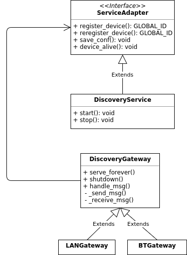

The used scripts all require Python 3!!!

## Directory Structure
* [rmpdiscovery](rmpdiscovery): the library containing the discovery and advertise service. The discovery service may be run alongside the MBP to discover devices. The advertise service may be used by devicees to register themselves at the MBP.

* the files rmpadvertise.*, rmpdiscovery.* and rmpvaluelogger.* are used to deploy and run the respective services using systemd.
* discoverygui.py offers a basic GUI to view the devices currently registered for monitoring

## Installing services
The discovery service is installed alongside the MBP using the install.sh script.
To install and run the advertise service, use the install-advertise.sh script.

The services are installe using systemd so they can be started and stop, using:

    sudo systemctl start <service>
    sudo systemctl stop <service>

## Discovery service

The discovery service is implemented in the [discovery](rmpdiscovery/discovery) package.
The following diagram hopefully clarifies the structure: 

The discovery gateways detect new devices in their network and register them at the discovery service.
For each network technology there must be a specialized implementation of the `DiscoveryGateway` class. 

## Necessary Libraries

The file [python-packages.py](python-packages.txt) lists all used python packages.
They can be installed using
    
    sudo pip install -r python-packages.txt
    
    
## Haftungsausschluss

Dies ist ein Forschungsprototyp.
Die Haftung für entgangenen Gewinn, Produktionsausfall, Betriebsunterbrechung, entgangene Nutzungen, Verlust von Daten und Informationen, Finanzierungsaufwendungen sowie sonstige Vermögens- und Folgeschäden ist, außer in Fällen von grober Fahrlässigkeit, Vorsatz und Personenschäden, ausgeschlossen.

## Disclaimer of Warranty

Unless required by applicable law or agreed to in writing, Licensor provides the Work (and each Contributor provides its Contributions) on an "AS IS" BASIS, WITHOUT WARRANTIES OR CONDITIONS OF ANY KIND, either express or implied, including, without limitation, any warranties or conditions of TITLE, NON-INFRINGEMENT, MERCHANTABILITY, or FITNESS FOR A PARTICULAR PURPOSE.
You are solely responsible for determining the appropriateness of using or redistributing the Work and assume any risks associated with Your exercise of permissions under this License.